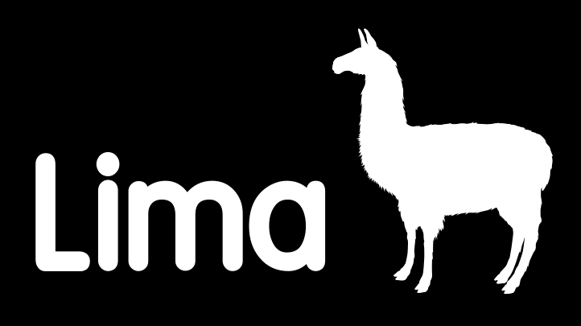

---
hide:
  - navigation
---

# LIMA — Libre Multilingual Analyzer

{ width="320" }

LIMA is a multilingual natural language processing (NLP) analyzer developed by
[CEA LIST](https://list.cea.fr/en/), in its Text and Image Semantic Analysis
laboratory (LASTI). It is free software, released under the
[MIT license](project/license.md).

LIMA combines two complementary approaches:

- **Neural modules** (built on libtorch, the PyTorch C++ library) for
  tokenization, part-of-speech tagging and morphological features,
  lemmatization and dependency parsing, with
  [models for more than 60 languages](https://github.com/aymara/lima-models)
  trained on [Universal Dependencies](https://universaldependencies.org/)
  treebanks.
- **ModEx rules**: a powerful finite-state rule formalism to extract entities,
  relations and events in domains where no annotated data exists.

Results are produced in [CoNLL-U](usage/output-formats.md) by default.

-   :material-rocket-launch:{ .lg .middle } **Getting started**

    ---

    Install LIMA and analyze your first text in a few minutes.

    [:octicons-arrow-right-24: Getting started](getting-started.md)

-   :material-download:{ .lg .middle } **Install**

    ---

    Python package, Docker image, Linux packages or build from source.

    [:octicons-arrow-right-24: Installation options](install/index.md)

-   :material-console:{ .lg .middle } **Using LIMA**

    ---

    Models, command line, Python API, pipelines and configuration.

    [:octicons-arrow-right-24: User guide](usage/index.md)

-   :material-book-open-variant:{ .lg .middle } **Reference**

    ---

    Configuration files, ModEx rules, process units, Python and C++ APIs.

    [:octicons-arrow-right-24: Reference](reference/index.md)

## Features

- Fast C++ engine with a native [Python API](usage/python.md) and a simple
  [graphical interface](usage/gui.md).
- Neural [Universal Dependencies analysis](guides/ud-analysis.md):
  tokenization, sentence splitting, UPOS and morphological features,
  lemmatization and labeled dependency parsing.
- [Named entity recognition](guides/ner.md) for English and French.
- Rule-based [information extraction](guides/writing-a-modex.md) with ModEx:
  extract new kinds of entities, relations or events without annotated data.
- Legacy linguistic pipeline for English and French: full-form dictionaries,
  hyphenated and concatenated words splitting, idiomatic expressions, rule-based
  parsing, coreference resolution and semantic analysis.
- A [plugin architecture](developers/architecture.md): pipelines are assembled
  from configuration files and can be extended without recompiling LIMA.
- Regression testing and evaluation tools.

## Get in touch

- Questions, bug reports and suggestions: open a
  [GitHub issue](https://github.com/aymara/lima/issues).
- Want to help? Read the [contributing guide](developers/contributing.md).
- To integrate LIMA in your projects or to develop resources and models for
  your needs, contact [CEA LIST](project/index.md#contact).
