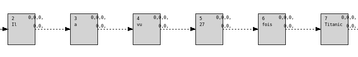
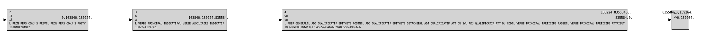
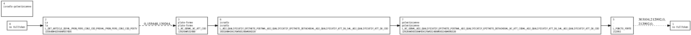
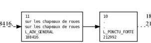
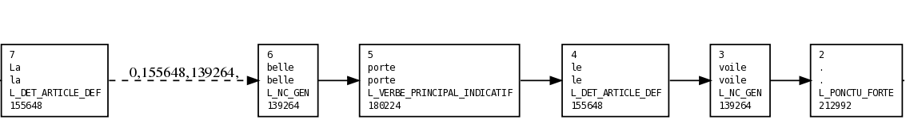
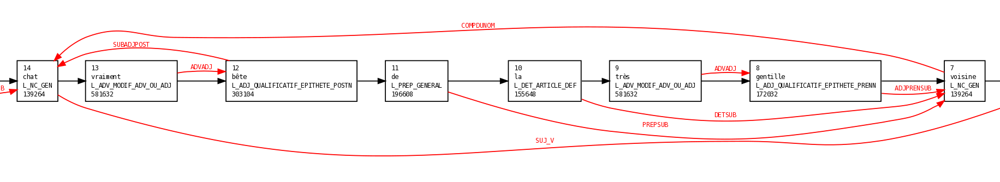

# Linguistic processing steps

## Introduction

This page presents the different classical steps of language processing as handled by LIMA. For each step we will highlight processing mechanisms and resources used. We begin by examining the treatments used for the analysis of French , which will allow to understand the whole system. Then we look at the specific treatment of other languages, and finally we will draw up an inventory of linguistic resources.

We describe the data structures being manipulated while presenting processing modules.

## French linguistic processing

The analysis of a language consists of four major steps:

1. Tokenization: division of the text into tokens. Uses only characters.

2. Morphological analysis: assigning possible grammatical categories. Produce some local splittings (eg when handling idioms). Use only morphological information.

3. Part of Speech (PoS) Tagging and Parsing: extracts relevant grammatical category for each token and uses the categories to construct the syntactic dependencies. This analysis level uses the context of words.
     
4. Semantic Analysis: Disambiguation of word senses and semantic role labeling identifying the semantic role of the syntagms.

Each of these main steps is itself divided into basic steps. In addition, steps of producing analysis traces or intermediate results can be inserted between these analysis steps. All these steps are processing units or ProcessUnit. Together, they represent a sequence named ProcessUnit pipeline. A data structure called AnalysisContent is transmitted from a ProcessUnit to the next. It contains a set of analysis (AnalysisData) named data.

Each ProcessUnit is initialized with a \<group\> element from an XML configuration file.

Sections below provide a simplified view of the various ProcessUnit.

### Tokenization

Resources used : Characters table and splitting automaton (tokenizerAutomaton-fre.xml file)

Task description : The goal is to split the original text into tokens and connect them according to their sequence in the text. This step creates a graph containing a node for each token found and an arc between each pair of adjacent tokens. This graph is called an **analysis graph** ( AnalysisGraph ) to differentiate it from other graphs used in the remaining of the analysis. AnalysisGraph nodes are numbered from 0. In addition to the nodes corresponding to the tokens, the AnalysisGraph contains two "empty" nodes (with no attached information), nodes 0 and 1.

In French the tokenizer splits on spaces and dots, dealing intelligently dots indicating an abbreviation. (e.g. in F. Hollande, the dot after F is not an end of a sentence point). The tokenizer assigns to each token a tokenization status based on the characters it contains.

    ex: Il a vu 27 fois Titanic à l'U.G.C. de CLERMONT.

    token      statut
    ---------- ------------------
    Il         t\_capital\_1st
    a          t\_small
    vu         t\_small
    27         t\_integer
    fois       t\_small
    Titanic    t\_capital\_1st
    à          t\_small
    l'         t\_small
    U.G.C.     t\_acronym
    de         t\_small
    CLERMONT   t\_capital
    .          t\_sentence\_brk

  : Tokens of the example sentence and their tokenization status

### SimpleWord: consulting the dictionary language

Resources used: Language dictionary, character table. 

Description: For each token, the language dictionary is interrogated in order to retrieve the list of possible grammatical categories and other morphological traits it is possible to assign to this token. If the token does not exist, the dictionary is queried with its unaccented and uncapitalized form. The dictionary has links to reaccentuated forms, which allows to find some orthographic corrections of the word. This is useful for example for fully capitalized words.

[Note [1]](#note1)

    > ex : "fois" gives the informations :
    >
    >     DictionaryEntry : form="fois"  final="false"
    >     - has linguistic infos :
    >     foundLingInfos : l="fois" n="fois"
    >     foundProperties : GENDER=FEM, MACRO=NC, MICRO=NC_GEN, NUMBER=SING,
    >     foundProperties : GENDER=FEM, MACRO=NC, MICRO=NC_GEN, NUMBER=PLUR,
    >     foundProperties : GENDER=FEM, MACRO=NC, MICRO=NC_ATT_COD, NUMBER=SING,
    >     foundProperties : GENDER=FEM, MACRO=NC, MICRO=NC_ATT_COD, NUMBER=PLUR,
    >     foundProperties : GENDER=FEM, MACRO=NC, MICRO=NC_U_MESURE, NUMBER=SING,
    >     foundProperties : GENDER=FEM, MACRO=NC, MICRO=NC_U_MESURE, NUMBER=PLUR,
    >     endLingInfos
    >     - has no concatenated infos
    >     - has no accented forms
    >
    > "légéreté" n'existe pas dans le dictionnaire. En revanche, sa
    > désaccentuation "legerete" va donner les informations suivantes :
    >
    >     DictionaryEntry : form="legerete"  final="false"
    >     - has no linguistic infos
    >     - has no concatenated infos
    >     - has accented forms :
    >     foundAccentedForm : form="légèreté"
    >     foundLingInfos : l="légèreté" n="légèreté"
    >     foundProperties : GENDER=FEM, MACRO=NC, MICRO=NC_GEN, NUMBER=SING,
    >     foundProperties : GENDER=FEM, MACRO=NC, MICRO=NC_ATT_COD, NUMBER=SING,
    >     endLingInfos
    >     endAccentedForm

The dictionary may also contain concatenated entries , such as "It's =\> It + is" in English. In this case , the token is replaced by two tokens , one for each component of the concatenated input.

Figure below shows a sample graph after access to the dictionary. For each node, you can see its number, its surface form (as it appears in the text ), its lemma (dictionary form) , the list of possible categories and the numerical values ​​of the token linguistic properties. These numerical values ​​are an integer coded representation  (compact and easy to handle) of all the morphological information of the token (category , time, gender, number, etc.) . A dedicated API allow to manipulate these codes to access the internal values ​​, the symbolic values, etc.

All tokens that were not found in the dictionary, neither in their surface form of their unaccentuated one remain unchanged, ie without linguistic information.

### HyphenWord : cutting words with dashes

Resources used : Language dictionary, character table

Task Description : All words with a dash (ie with a '-') without any language information are splitted and each part is looked for in the dictionary. Attention, it is possible that a word with a dash exists in the dictionary, eg " plate-forme" (French). In this case it is handled in the previous step. Are handled here, onel words that do not have any linguistic information.

    > Eg " Israeli-Palestinian " does not exist in the dictionary. therefore
    > It will be split into " Israeli " and " Palestinian " that exist in the
    > dictionary .

The treatment also checks if the first word is not a known prefix. The prefixes are followed by a '-' in the dictionaries. For example , there is a "Franco-" entry in the French dictionary that attributes categories  different than those for "franco" (without '-' the word might be a reaccentuation to a proper noun while in a dash word it is impossible).

### Recognition of idioms

Resources used: Idioms recognition rules

Task Description : Detect multiple tokens that constitute an idiom and assemble them into a single token.

    > Ex: Il a démarré sur les chapeaux de roues.
    > (sur les chapeaux de roues) is an idiom, 5
    > tokens will therefore be replaced by only one with the category
    > Adverb.

The example below shows that the original nodes are preserved. We will see later that the link between the new node and those is stored in another graph, called annotation graph.

An idiom may be recognized on contiguous forms as in the previous example, but also on lemmas and for not contiguous expressions. This is the case of many expressions and also of reflexive verbs in French.

    > ex: Il s'est trompé.
    >
    > Here the reflexive verb " se tromper " is an idiom

An idiom can be absolute or not. An absolute expression, when it is recognized , will be replaced by a token , whereas if it is not absolute , an alternative is added in the graph without deleting original nodes. 

    > Ex : Nous nous trompons, nous trompons nos maris, il n'y a pas de
    > raison.
    >
    > "nous trompons" is an idiom that recognizes a
    > reflexive verb . This expression is not absolute. In the first part of
    > the example it is indeed the reflexive verb while it is not in the second one.

### Handling of unknown words

Resources Used: List of default categories (default-fre.txt) 

Task Description: This treatment involves assigning to each token remaining without any linguistic information default categories depending on its tokenization status. It is at this level that numbers in Arabic and Roman numerals are handled, but also acronyms and words that are not in the dictionary. Words beginning with a capital letter will be labeled  as proper names. The numbers may receive categories like numeral cardinal determiner, numeral cardinal pronoun, etc. 

The association between tokenization statuses and categories is done at the analysis dictionary source level.

### Named entity recognition

Resources used : Named entities rules.

Task Description : Recognition of named entities consists in identifying dates, locations, times, numeric expressions, products, events and organizations present on one or more tokens, and in replacing them by a single token. Unlike the treatment of idioms, treatment of named entities never retains the old tokens. This recognition is based on a set of lists and rules. One use lists of places, surnames, organizations, etc. The rules allow use triggers (like "Mr ... " or "the company ..." . The full syntax of these rules is described in separate document. note that the same rules engine is used also for the recognition of idioms and syntactic dependency parsing.

In the case of the analysis of French, the treatment of entities is placed before the disambiguation, which is not the case in all languages​​.

    > ex : Samedi 1er Avril, le président J. Chirac a reçu la visite du
    > chef d'état du Togo
    >
    > The named entities present in this sentence are:
    >
    > -   Samedi 1er Avril : DATE
    >
    > -   J. Chirac : PERSON
    >
    > -   Togo : LIEU
    >

Also note that we can extend the concept beyond pure " named " entities. One can identify in the same way entities specific to a domain. We call them  Specific Entities. For example, in aeronautics, there will be types of entities like " airline ", " aircraft manufacturer ", " aircraft model " , etc.

The description of named entities is the occasion to introduce a data structure used in various parts of the analysis, the annotation graph or AnnotationGraph . This is a graph whose vertices and edges can carry annotations, each annotation containing any C++ object thanks to the use of the `boost` [[2](#note2)] library `boost::any`.

The AnnotationGraph is a generic tool. In LIMA, we decided to insert a node for each node of the AnalysisGraph and the PosGraph. Each of these nodes is annotated to identify the graph and the node to which it corresponds. In the figure, one can see that 24 node corresponds to node 7 of the PosGraph.

The top figure (TODO insert figure) shows an excerpt from the AnalysisGraph before named entity recognition. The bottom right shows the same graph after and the left one the corresponding extract in the annotation graph. Nodes 2, 3 and 4 have been replaced by AnalysisGraph node 9. This information is found in the annotation named SpecificEntity in the annotation graph, in its attribute named vertices. Similarly, nodes of the annotation graph corresponding to the AnalysisGraph nodes 2, 3 and (here 2, 3 and 4 as well) are connected by an arc annotated " belongstose " to the node corresponding to that of the named entity.

### Disambiguation (PoS Tagging)

Resources used: Disambiguiation matrices: bigrams and trigrams 

Task Description: This task is to select valid category(ies) available among all the grammatical categories from morphological analysis. For this matrices of categories trigrams and bigrams weighted by their frequency are used. These matrices are derived from an annotated text. The program allows to keep either all possible categories or only the most probable one.

Example: "La belle porte le voile."
>
>     1 | La | le#DET
>     4 | belle | belle#NC
>     10 | porte | porter#V
>     16 | le | le#DET
>     19 | voile | voile#NC
>     24 | . | .#PONCTU_FORTE

This example is interesting because it is very ambiguous. 'belle' 
can be ADJ or NC, 'porte' can be NC or V and 'voile' can be NC or V. 
Syntax only is not enough to solve the ambiguity, since there are 
two possible interpretations both grammatically valid: a beautiful 
woman wearing a veil, or a beautiful door hiding something. This 
interpretation is more difficult but the sentence structure is 
correct. 

Here we configured the POS Tagger so it keeps only the most common 
option. 

Let's now look at: "La belle porte le retient." Here 'retient' cannot 
be NC but verb only.

>     1 | La | le#DET
>     4 | belle | bel#ADJ
>     10 | porte | porte#NC
>     16 | le | le#PRON
>     19 | retient | retenir#V
>     26 | . | .#PONCTU_FORTE

The example shows that the task of disambiguation is a global one. 
'retient' can only be a verb, then 'porte' becomes NC and 'beautiful' ADJ.

In case of a disambiguation error, one of the first things to verify is that expected bigrams and trigrams provided are present in the disambiguation matrix. If this is not the case, the training corpus must be enriched with sentences containing the new n-grams.

Concerning data structures, this step generates a new graph, the same kind as the AnalysisGraph but where each node has one and only one tag. Note that the nodes can still have several codes after this step because it disambiguates the tag only and not other traits such as gender, time or number. The new graph is called PosGraph.

It is at this level that the numbers appearing on graph edges in the figures become meaningful : they are tags bigrams and trigrams (in coded form) that are absent from the matrices. Thus, this information can help to understand why an interpretation is chosen over another and give the possibility to complete the training corpus with a piece of text allowing to complete the matrices.

### Recognition of nominal and verbal chains

Resources used : Nominal and verbal chains matrices.

This module is inherited from previous versions of the analyzer. It could probably be removed at the cost of some refactoring.

Task Description : The goal is to identify nominal and verbal groups. But these groups are not the usual chunks as chains connect all nodes in more or less distant relation with a name for a nominal chain or a verb for a verbal chain. 

Chains are defined by a set of categories able to start them (the category definite article is in this set for nominal chains in French, for example), a set of categories that can finish them (common noun, for example) and a set of possible transitions between categories (the transition definite article -\> common noun is possible in French). The algorithm is quite complex since it must find all possible chain paths in the graph while avoiding chains too short or included into each other.

### Syntactic dependency analysis

Resources used : Parsing rules 

Task Description : The dependency analysis is based on syntactic rules that allow the recognition of syntactic dependencies in function of words grammatical categories. These rules are again described using the syntax described in [ModEx rules format](modex-rules.md) . It specifically uses the constraint description mechanism to check such things as non presence of a dependency relation between the nodes involved (to avoid cycles), the agreements in number and gender, etc.

The dependency relations are stored in a dedicated data structure (named DepGraph in AnalysisData) which is a Boost graph containing a node for each PosGraph node and an edge for each dependency relation found. The sole property of edges is the name of the dependency they support.

         @PrepComp:(@NomCommun|@Inc) (@AdverbePositifDansChaineNominale|@AdjPost|@DetNum|@PrepComp|@NomPropre){0-3} 
            (@NomPropre)?:((@DetIndef)? @Determinant)? (@AdverbePositifDansChaineNominale|@AdjPren|@Prefixe){0-n} 
            ((@Prenom){0-n} (de (la)?)?)? (@NomCommun|@NomPropre|@Inc|$ADJ-ADJ)
           :COMPDUNOM:
         +!GovernorOf(left.1,"SUBSUBJUX")
         +SecondUngovernedBy(right.4,left.1,"ANY")
         +SecondUngovernedBy(trigger.1,right.4,"ANY")
         +CreateRelationBetween(right.4,left.1,"COMPDUNOM")
         +CreateRelationBetween(trigger.1,right.4,"PREPSUB")
         =>AddRelationInGraph()
         =<ClearStoredRelations()

The listing above shows a rule used to identify noun complement, as in `chat vraiment bête de la très gentille voisine`. In this case, this rule will create the relationship COMPDUNOM from 'voisine' to 'chat' as can be seen in the figure below.

Note the use of the constraint `!GovernorOf` which verifies that the name that will be the target of the relationship is not the source of a relationship between juxtaposed nouns (because in this case it is the target noun of the latter that has to be the target of the complementation). One can also see the use of twice the constraint `CreateRelationBetween`. It creates the indicated relation when the two involved nodes are found during the search and store it in a temporary structure. If the rule is finally validated, stored relations are finally added to the graph (`AddRelationInGraph` successful action). Otherwise they are discarded (`ClearStoredRelations` failure action).

The parsing rules are not all in a single rules file. In fact , they are not even in a single all ProcessUnit (pipeline element). The rules are divided into several ProcessUnit and several actions in each of them for clarity or because some dependencies are required to be found before another to provide support for the analysis.

### Semantic Role Labeling (SRL)

Install python3 if needed.

Install python setuptools at version 9.1 (our NLTK copy is not compatible with the newest one):

    pip install setuptools==9.1

Clone knowledgesrl:

    git clone git@github.com:aymara/knowledgesrl.git --recursive
    cd knowledgesrl

Install dependencies:

    pip install -r dependencies.txt

Install WordNet from NLTK data:

    python3
    >>> import nltk
    >>> nltk.download()
    Downloader> d wordnet

In `lima-lp-eng.xml`, replace the string "(path to knowledgesrl)" by the right path:

    <group name="srl" class="ExternalProcessUnit">
      <param key="dumper" value="conllDumperToFile"/>
      <param key="inputSuffix" value=".conll"/>
      <param key="outputSuffix" value=".conll.srl"/>
      <param key="command" value="(path to knowledgesrl)/src/main.py --conll_input %1 --conll_output %2"/>
      <param key="loader" value="srlLoader"/>
    </group>

And activate the modules `VerbNetRecognition` and `srl` in the pipeline you want to use (`main` by default).

## Linguistic Resources

###  Characters table and splitting automaton

The file 'tokenizerAutomaton-fre.chars.tok contains the description of UTF-8 characters used in the language, and their uncapitalization and unaccentuation if needed. 

The file 'tokenizerAutomaton-fre.tok contains the definition of the splitting automaton. 

The format of both files is described in [Flat Tokenizer](process-units/tokenization.md#flattokenizer) page.

### Language dictionary

The language dictionary contains for each word of the language, all linguistic information possible for that word. Linguistic information can be: 

- lemma, normalized form, linguistic properties (gender, number, grammatical categories)

        Interrogation du dictionnaire pour le mot : "cours" :

        foundLingInfos : l="cour" n="cour"
        foundProperties : GENDER=FEM, MACRO=NC, MICRO=NC_GEN, NUMBER=PLUR,
        foundProperties : GENDER=FEM, MACRO=NC, MICRO=NC_ATT_COD, NUMBER=PLUR,
        foundProperties : GENDER=FEM, MACRO=NC, MICRO=NC_ANNONCEUR_SOCIETE, NUMBER=PLUR,
        foundProperties : GENDER=FEM, MACRO=NC, MICRO=NC_ANNONCEUR_NOM, NUMBER=PLUR,
        endLingInfos
        foundLingInfos : l="courir" n="courir"
        foundProperties : MACRO=V, MICRO=V, NUMBER=SING, PERSON=1, SYNTAX=TRANS, TIME=PRES,
        foundProperties : MACRO=V, MICRO=V, NUMBER=SING, PERSON=2, SYNTAX=TRANS, TIME=PRES,
        foundProperties : MACRO=V, MICRO=V, NUMBER=SING, PERSON=1, SYNTAX=INTRANS, TIME=PRES,
        foundProperties : MACRO=V, MICRO=V, NUMBER=SING, PERSON=2, SYNTAX=INTRANS, TIME=PRES,
        foundProperties : MACRO=V, MICRO=VIMP, NUMBER=SING, PERSON=2, SYNTAX=TRANS, TIME=PRES,
        foundProperties : MACRO=V, MICRO=VIMP, NUMBER=SING, PERSON=2, SYNTAX=INTRANS, TIME=PRES,
        endLingInfos
        foundLingInfos : l="cours" n="cours"
        foundProperties : GENDER=MASC, MACRO=NC, MICRO=NC_GEN, NUMBER=SING,
        foundProperties : GENDER=MASC, MACRO=NC, MICRO=NC_GEN, NUMBER=PLUR,
        foundProperties : GENDER=MASC, MACRO=NC, MICRO=NC_ATT_COD, NUMBER=SING,
        foundProperties : GENDER=MASC, MACRO=NC, MICRO=NC_ATT_COD, NUMBER=PLUR,
        foundProperties : GENDER=FEM, MACRO=NC, MICRO=NC_ANNONCEUR_LIEU, NUMBER=SING,
        foundProperties : GENDER=FEM, MACRO=NC, MICRO=NC_ANNONCEUR_SOCIETE, NUMBER=SING,
        foundProperties : GENDER=FEM, MACRO=NC, MICRO=NC_ANNONCEUR_SOCIETE, NUMBER=PLUR,
        foundProperties : GENDER=FEM, MACRO=NC, MICRO=NC_ANNONCEUR_NOM, NUMBER=SING,
        foundProperties : GENDER=FEM, MACRO=NC, MICRO=NC_ANNONCEUR_NOM, NUMBER=PLUR,
        endLingInfos

-   concatanated form, in this case, each component is discribed

        foundConcatenated
        foundComponent : form="it" pos="0" len="2"
        foundLingInfos : l="it" n="it"
        foundProperties : MACRO=PRON, MICRO=PRP,
        endLingInfos
        endComponent
        foundComponent : form="'s" pos="2" len="2"
        foundLingInfos : l="be" n="be"
        foundProperties : MACRO=V, MICRO=VBZ,
        endLingInfos
        foundLingInfos : l="have" n="have"
        foundProperties : MACRO=V, MICRO=VBZ,
        endLingInfos
        endComponent
        endConcatenated

-   link toward an accentuated form.

        foundAccentedForm : form="évite"
        foundLingInfos : l="éviter" n="éviter"
        foundProperties : MACRO=V, MICRO=V, NUMBER=SING, PERSON=1, SYNTAX=TRANS, TIME=PRES,
        foundProperties : MACRO=V, MICRO=V, NUMBER=SING, PERSON=3, SYNTAX=TRANS, TIME=PRES,
        foundProperties : MACRO=V, MICRO=V, NUMBER=SING, PERSON=1, SYNTAX=INTRANS, TIME=PRES,
        foundProperties : MACRO=V, MICRO=V, NUMBER=SING, PERSON=3, SYNTAX=INTRANS, TIME=PRES,
        foundProperties : MACRO=V, MICRO=V, NUMBER=SING, PERSON=1, SYNTAX=PRONOMINAL, TIME=PRES,
        foundProperties : MACRO=V, MICRO=V, NUMBER=SING, PERSON=3, SYNTAX=PRONOMINAL, TIME=PRES,
        foundProperties : MACRO=V, MICRO=VS, NUMBER=SING, PERSON=1, SYNTAX=TRANS, TIME=PRES,
        foundProperties : MACRO=V, MICRO=VS, NUMBER=SING, PERSON=3, SYNTAX=TRANS, TIME=PRES,
        foundProperties : MACRO=V, MICRO=VS, NUMBER=SING, PERSON=1, SYNTAX=INTRANS, TIME=PRES,
        foundProperties : MACRO=V, MICRO=VS, NUMBER=SING, PERSON=3, SYNTAX=INTRANS, TIME=PRES,
        foundProperties : MACRO=V, MICRO=VS, NUMBER=SING, PERSON=1, SYNTAX=PRONOMINAL, TIME=PRES,
        foundProperties : MACRO=V, MICRO=VS, NUMBER=SING, PERSON=3, SYNTAX=PRONOMINAL, TIME=PRES,
        foundProperties : MACRO=V, MICRO=VIMP, NUMBER=SING, PERSON=2, SYNTAX=TRANS, TIME=PRES,
        foundProperties : MACRO=V, MICRO=VIMP, NUMBER=SING, PERSON=2, SYNTAX=INTRANS, TIME=PRES,
        foundProperties : MACRO=V, MICRO=VIMP, NUMBER=SING, PERSON=2, SYNTAX=PRONOMINAL, TIME=PRES,
        endLingInfos
        endAccentedForm
        foundAccentedForm : form="évité"
        foundLingInfos : l="éviter" n="éviter"
        foundProperties : GENDER=MASC, MACRO=V, MICRO=VPP, NUMBER=SING, SYNTAX=TRANS, TIME=PASS,
        foundProperties : GENDER=MASC, MACRO=V, MICRO=VPP, NUMBER=SING, SYNTAX=INTRANS, TIME=PASS,
        foundProperties : GENDER=MASC, MACRO=V, MICRO=VPP, NUMBER=SING, SYNTAX=PRONOMINAL, TIME=PASS,
        endLingInfos
        foundLingInfos : l="évité" n="évité"
        foundProperties : GENDER=MASC, MACRO=ADJ, MICRO=ADJ, NUMBER=SING,
        endLingInfos
        endAccentedForm

The binary dictionary used during the analysis is generated from a list of simple words that are inflected to produce all possible forms of the language. This list is then enriched with various information and compiled. 

### Idioms

Idioms are automata, like named entities and parsing rules below. But we have a simplified input format: 

    D;;A;Porto;Porto Rico;nom propre féminin;
    D;;A;[S]&Ministre;[J]Premier [S]&Ministre;nom masculin;Premier Ministre
    D;;;beau;[V]&avoir (D) beau faire;verbe intransitif;avoir beau faire

In this format, there are several fields separated by ';':
- 1st field: unused; 
- 2nd field: unused; 
- 3rd field: 'A' indicates an absolute idiom; 
- 4th field: trigger: token triggering the rule; 
- 5th field: the idiom; 
- 6th field: the part of speech; 
- 7th field: normalization.

### Disambiguation Matrices

Disambiguation matrices are a set of n-grams together with their frequency. E.g., a trigram is a possible succession of three grammatical categories. To build these linguistic resources we use annotated and disambiguated corpus, ie where each token is accompanied with its correct grammatical category. 

Example: extract of an annotated corpus 

    À la suite de	P
    la	DET
    parution	NC
    le	DET
    matin	NC
    même	ADJ
    d'	P
    un	DET
    article	NC

From this annotated text are extracted categories successions, which are then combined and recorded in the n-grams matrices. The correspondence between the category names used in the corpus and the names of internal categories are listed in a file named `code_symbolic2lic2m.txt` present in the same directory as the corpus file.

### Rules for named entities and syntactic dependencies

Recognition of named entities and syntactic dependencies relies on automaton rules. In the case of names entities, the rules are built from word lists (names, cities, countries, ...) and  structure rules using triggers (Sir, society, ...). The rules for syntactic dependencies are essential based on the syntactic structure of the sentence and are based on grammatical categories recognized by the system. The rules syntax is described here: [ModEx rules format](modex-rules.md). 

The program to compile a rules file is `compile-rules`: 

    compile-rules --language=\<lang\> --output=\<binary output file\> \<rules input file\>

<a name="note1">[1]</a>: All examples of accessing to the language dictionary are made using the `composedDict` program, for example with the command "`composedDict --language=fre --dicoId=mainDictionary --key=fois`"

<a name="note2">[2]</a>: Boost is a collection of C++ libraries. It includes, among others, a library for the recognition of regular expressions, a dates and times management library and a graphs management library. This is this Boost Graph Library (BGL) which is used to store all graphs manipulated by LIMA. 

<a name="note3">[3]</a>: A full word is a word that carries a semantic information by itself. Are classified generally as full words the nouns, verbs and adjectives. In contrast, empty words are those that do not directly relate to a concept, such as articles or prepositions, for example.

## Modules not included in the open-source release

The following processing modules exist in CEA LIST's internal version of LIMA
but are **not part of the open-source (MIT) release**. They are documented here
because they explain why some languages have a different processing chain.

### De-agglutination (German)

**Resources used:**

* *desagglutination categories*: the mapping of categories used for
  de-agglutination;
* *desagglutination delimiters*: the list of possible delimiters between the
  agglutinated parts.

**Task description:** this module checks whether a token is an agglutination of
several tokens, possibly separated by a delimiter. The parts are looked up in
the language dictionary and the possible delimiters are given by a resource.
The agglutinated words are full words[^full-word]. In practice, the global word
receives the possible categories of its last agglutinated part. These
categories are used by the PoS tagger; a second module
(`DesagglutinationExpander`) then splits the components so that the parts can be
extracted.

> Example: *Vorlesungsbetrieb* ⇒ *Vorlesung* + (*s*) + *betrieb*
>
> *Vorlesung* and *betrieb* are two full words of the dictionary. *betrieb* can
> be a verb or a common noun, so the agglutinated word gets the possible
> categories of its last component: verb or common noun.

### HyperwordStemmer (Arabic)

**Resources used:** dictionaries of proclitics, enclitics and stems (language
dictionary).

**Task description:** this module splits words made of a proclitic, an enclitic
and a stem. Proclitics and enclitics are looked up in dedicated dictionaries.

### ChineseSegmenter (Chinese)

**Resources used:** language dictionary.

**Task description:** this module proposes segmentations of Chinese sentences.
The sentence is cut progressively using words found in the dictionary. Only the
segmentations with a minimal number of words are kept, with a configurable
tolerance (for example, with a tolerance of 1, if the shortest path has 5 words,
paths of 5 and 6 words are kept). The resulting segmentations are then filtered
by the PoS tagger. A variant is used for Japanese.

[^full-word]: A full word carries semantic information by itself: generally
    nouns, verbs and adjectives. Empty words, such as articles or
    prepositions, do not directly relate to a concept.
