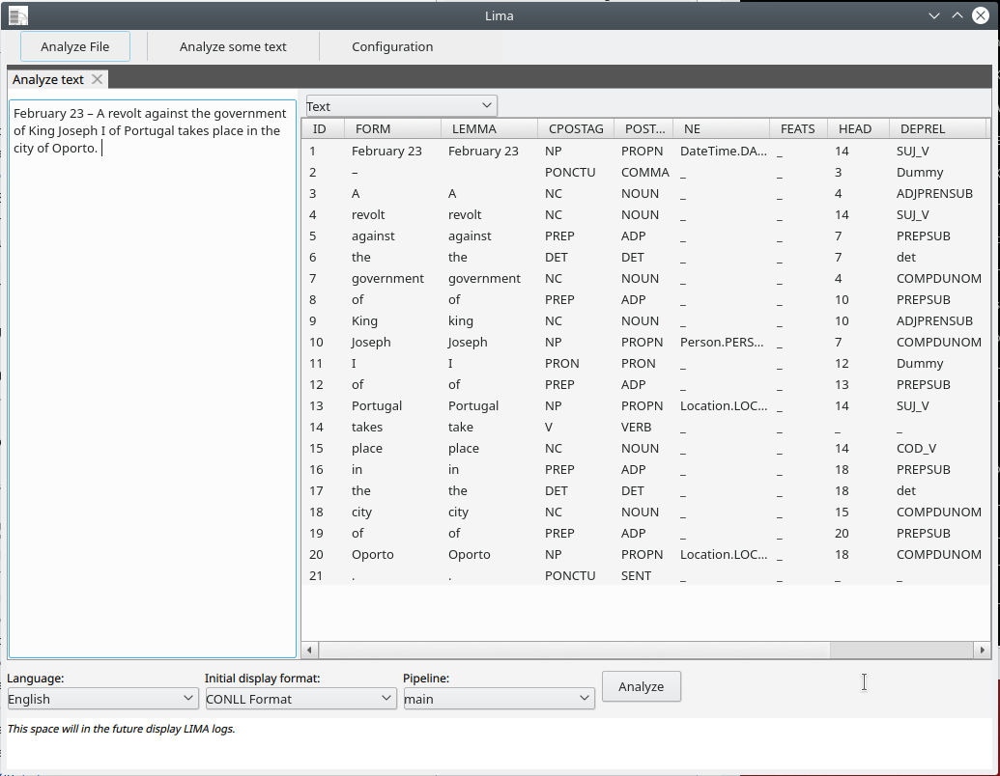

# Graphical interface

LIMA comes with a simple Qt graphical interface, the `lima` command of the
C++ installation (it is not part of the Python package). It is handy to try
LIMA and to look at analysis results.

1. Run `lima`.
2. Click *Analyze some text* in the toolbar, then write or paste some text
   (*Analyze file* analyzes a file instead).
3. In the bottom bar, select the language, the output format (e.g. *CoNLL
   Format*) and the pipeline.
4. Click *Analyze*, or press ++ctrl+shift+a++.

For each token you get its part of speech, its entity type if it is part of a
named entity, and its syntactic head and relation (HEAD and DEPREL columns).

The interface is still basic: for real use, rely on the
[command line](cli.md) or the [Python API](python.md) and on the
[configuration files](configuration.md).
